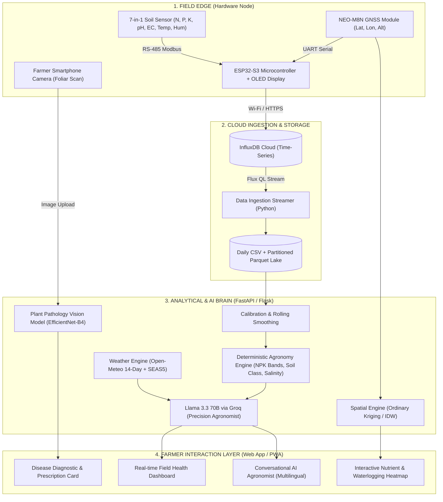

# 🌿 PROJECT KRONOS: Smart Soil Intelligence & Precision Agronomy System
**Submission Category:** Innovation for Mankind / Prototype Design / Agri-Tech & Sustainability  
**Tagline:** *Closing the loop from soil chemistry to actionable farmer intelligence.*

---

## 1) Problem Statement (Max 300 words)

Agriculture in developing nations faces severe systemic challenges that jeopardize food security and smallholder livelihoods. Farmers currently operate with blind spots across three critical dimensions:

1. **Information Asymmetry & Delayed Diagnostics:** Traditional soil testing requires sending physical samples to centralized laboratories, taking 2 to 4 weeks. By the time results return, crop stages and dynamic soil conditions have fundamentally shifted.
2. **Raw Data Inactionability:** Commercial IoT soil sensors merely output raw electrical numbers (e.g., EC in $\mu S/cm$ or volumetric water content). Smallholder farmers cannot translate these parameters into exact fertilizer dosages ($kg/acre$), irrigation timings, or risk mitigation steps.
3. **Micro-Climate Blindness & Uneven Field Conditions:** Conventional practices apply uniform blanket fertilization and flood irrigation across entire fields, ignoring micro-topographical variations, local waterlogging, nutrient leaching, and real-time weather forecasts. This results in 30–45% fertilizer wastage, groundwater contamination, and progressive soil salinization.
4. **Late Disease Detection:** Crop diseases are often detected only after macroscopic foliar collapse has occurred, leading to irreversible yield losses of up to 40%.

Smallholders urgently require an affordable, field-deployable, real-time diagnostic and spatial advisory system that bridges the digital divide and converts sensor data into plain-language agricultural decisions.

*(Word Count: 198 words)*

---

## 2) Designed Solution to the Problem (Max 300 words)

**Project KRONOS** is an end-to-end, real-time precision agronomy ecosystem combining custom IoT edge hardware, cloud time-series processing, and generative AI advisory. 

### Core Architecture & Workflow:
- **Integrated Edge Sensor Node:** A ruggedized, portable field device powered by an **ESP32-S3 microcontroller** paired with an industrial **7-in-1 RS-485 Modbus soil probe**. It simultaneously captures Nitrogen (N), Phosphorus (P), Potassium (K), pH, Electrical Conductivity (EC), Moisture, and Temperature.
- **Continuous Ingestion Pipeline:** Edge readings are transmitted via Wi-Fi/cellular to **InfluxDB Cloud** at 1-second intervals, materialized into daily Parquet and CSV stores with millisecond checkpoints.
- **Deterministic Agronomy & Risk Engine:** The Python analytical core executes 3-point rolling calibrations, deterministic NPK banding calibrated for Indian alluvial soils, and dynamic soil texture classification (Sandy/Clayey/Loamy) using moisture-loss slopes ($dh/dt$) and EC.
- **Multi-Source Fusion AI:** The deterministic layer fuses with **Open-Meteo 14-day hyperlocal forecasts** and **ECMWF SEAS5 seasonal models**. This contextual payload prompts **Llama 3.3 70B (via Groq)** to generate stage-specific advisories detailing exact chemical/organic fertilizer formulations ($kg/acre$ in split doses), irrigation interventions, and disease risk warnings.
- **Spatial Temporal Mapping & Vision:** Enables multi-point field mapping using a single sensor across time/GPS coordinates to generate nutrient and waterlogging heatmaps, complemented by on-demand foliar disease detection via computer vision.

*(Word Count: 228 words)*

---

## 3) Process & Flow Diagram

### 🔄 End-to-End System Architecture



---

## 4) Core USP & Key Features of the Solution

### ⭐ Main Unique Selling Proposition (USP)
> **"Closing the Loop from Soil Chemistry to Field-Ready Prescriptions"**
> 
> Unlike standard IoT soil sensors that merely display raw, confusing electrical numbers, **KRONOS acts as an intelligent digital agronomist**. It synthesizes 15-second in-situ 7-parameter soil diagnostics with 14-day hyperlocal weather forecasts to deliver **exact metric fertilizer prescriptions ($kg/acre$ in split timings)**, **single-probe nutrient heatmaps**, and **foliar disease treatments** in regional vernaculars (Bengali, Hindi, English)—at less than 1/10th the cost of commercial laboratory setups.

---

### 🚀 Key Solution Features (Bulleted)
- ⚡ **15-Second In-Situ Testing:** Simultaneously captures Nitrogen (N), Phosphorus (P), Potassium (K), pH, Salinity (EC), Moisture, and Temperature in 15 seconds without laboratory wait times or chemical consumables.
- 🎯 **Metric-Precision Fertilizer Prescriptions:** Translates soil nutrient deficits into exact chemical and organic application rates (e.g., *Urea @ 35 kg/acre in 2 split doses; Basal SSP @ 45 kg/acre*) tailored to specific crop growth stages (DAS).
- 🗺️ **Single-Probe Spatial Field Mapping:** Leverages GPS-tagged temporal walks with a single hardware probe to construct high-resolution **Ordinary Kriging** nutrient and soil health heatmaps, eliminating the need for expensive multi-node arrays.
- 💧 **Waterlogging & Salinity Early Warning:** Identifies standing water pooling versus dry zones by correlating electrical conductivity (EC) and moisture dry-down slopes ($dh/dt$), preventing root asphyxiation.
- 🌦️ **14-Day Weather-Synchronized Advisory:** Integrates rain probability and temperature peaks to avoid fertilizing before heavy downpours (preventing runoff) and schedule pre-dawn heat stress irrigations.
- 🍃 **Vision AI Leaf Disease Diagnostics:** Identifies foliar pathogens from smartphone camera scans and cross-references them with live soil moisture and ambient temperature to assess disease escalation risks.
- 🗣️ **Multilingual Vernacular Interface:** Delivers plain-language, emoji-rich agricultural advisories and conversational guidance in Bengali, Hindi, and English for low-literacy smallholder accessibility.

---

## 5) Snapshots of Implementation

*(Note: The corresponding images from testing, physical node builds, and web UI can be placed in the designated slots below)*

| Figure 1: Hardware Node & Sensor Assembly | Figure 2: Real-time Web Dashboard |
|:---:|:---:|
|  |  |
| *Figure 1: ESP32-S3 edge node with RS-485 Modbus transceiver, 7-in-1 stainless probe, OLED display, and Li-Po power unit.* | *Figure 2: Web platform displaying live NPK status, calibrated soil classification, 14-day weather timeline, and Groq AI recommendations.* |

| Figure 3: Nutrient & Waterlogging Heatmap | Figure 4: Foliar Disease AI Diagnostic |
|:---:|:---:|
|  |  |
| *Figure 3: Spatial interpolation map illustrating Nitrogen distribution and moisture gradients across field zones.* | *Figure 4: Computer vision module identifying foliar blight with chemical/organic treatment protocols and soil correlation.* |

---

## 6) Impact to Society (Max 300 words)

Project KRONOS directly targets the United Nations Sustainable Development Goals (**SDG 2: Zero Hunger**, **SDG 12: Responsible Consumption and Production**, and **SDG 15: Life on Land**):

1. **Economic Upliftment of Smallholders:** By replacing arbitrary blanket fertilization with Variable Rate Application (VRA), farmers reduce chemical input costs by **20% to 35%**, while optimizing soil balance to increase crop yields by **15% to 25%**.
2. **Ecological Conservation & Soil Rejuvenation:** Overuse of synthetic Nitrogen causes nitrate leaching into rural drinking water and emits potent nitrous oxide. KRONOS halts soil acidification and secondary salinization by monitoring real-time pH and EC, recommending targeted organic amendments (e.g., agricultural lime or gypsum) only when biologically necessary.
3. **Climate Resilience & Water Optimization:** Linking irrigation schedules with 14-day weather forecasts prevents waterlogging and mitigates drought stress, saving thousands of liters of freshwater per acre per cropping cycle.
4. **Democratizing Precision Agriculture:** Traditional precision farming systems (e.g., John Deere VRA equipment or drone multispectral imaging) cost thousands of dollars. KRONOS packages high-performance IoT hardware (<$65 BOM) and free-tier cloud intelligence into an intuitive smartphone experience, bringing advanced agronomy to smallholder farming communities worldwide.

*(Word Count: 196 words)*

---

## 7) Unique Value Proposition (UVP) & Sustainable Business Model

### 💎 Unique Value Proposition (UVP)
> *"For smallholder farmers and agrarian cooperatives, KRONOS is the only soil intelligence system that converts 7-parameter in-situ chemistry and weather forecasts into exact, field-ready fertilizer dosages and disease cures in local languages at less than 1/10th the cost of commercial alternatives."*

### 🏢 Sustainable Deployment & Business Model
To ensure long-term viability while prioritizing humanitarian impact:

```
┌─────────────────────────────────────────────────────────────────────────┐
│                       KRONOS SUSTAINABLE MODEL                          │
├────────────────────────────────┬────────────────────────────────────────┤
│ 1. Community Cooperative Model │ FPOs (Farmer Producer Organizations)   │
│    (B2B2C / Community Hubs)    │ and Panchayats purchase hardware nodes │
│                                │ to share across 50–100 local farmers.  │
├────────────────────────────────┼────────────────────────────────────────┤
│ 2. Freemium Software Tier      │ • Free: Real-time diagnostics, chatbot │
│                                │ • Pro (₹99/mo): Multi-field heatmaps,  │
│                                │   advanced disease AI, exportable PDFs │
├────────────────────────────────┼────────────────────────────────────────┤
│ 3. Agri-Input Integration      │ Partnerships with local organic bio-   │
│    (Affiliate / Marketplace)   │ fertilizer vendors for direct ordering │
│                                │ based on diagnostic prescriptions.     │
├────────────────────────────────┼────────────────────────────────────────┤
│ 4. Carbon & Soil Health Credit │ Verified historical soil carbon & data │
│    Data Aggregation            │ logs for green agri-subsidies.         │
└────────────────────────────────┴────────────────────────────────────────┘
```
